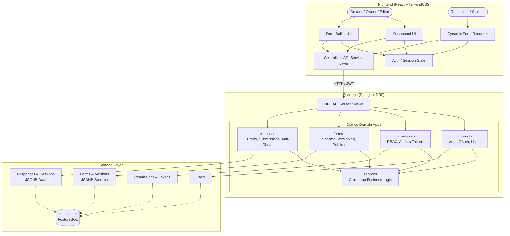

# Assessly Architecture Diagram

This file contains the Mermaid architecture diagram representing the Assessly project based on the documentation provided in `context/`.

## Description of Architecture Layers

1. **Frontend (React + TailwindCSS)**:
   - Handles the UI for Creators (Dashboard, Form Builder) and Responders (Form Renderer).
   - Follows a schema-driven approach where the UI structure is driven by the backend schema.
   - All external data fetching is centralized in the API Service Layer.

2. **Backend (Django + Django REST Framework)**:
   - Contains domain-isolated apps: `accounts`, `forms`, `responses`, and `permissions`.
   - The `services/` directory is used for shared business logic across multiple domains.
   - The backend is the strict single source of truth for all validation, form structure, permissions, and anti-cheat evaluations.

3. **Storage (PostgreSQL)**:
   - Persists all the structured data and entities.
   - Uses `JSONB` to store flexible form schemas and responses.
   - `Forms` use a public UUID identifier for the frontend/API, while maintaining numeric primary keys for internal relationships.
