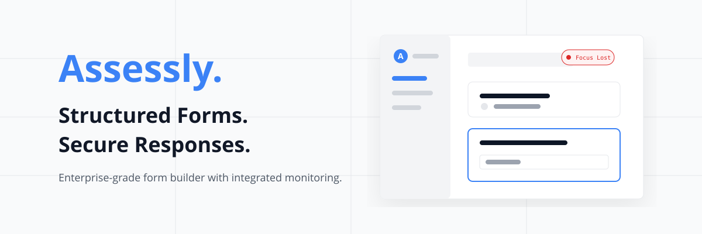

<div align="center">
  
</div>

<div align="center">
  
</div>

<h1 align="center">Assessly</h1>
<p align="center"><strong>A modern, schema-driven form builder with enterprise-grade anti-cheat & AI-generation capabilities.</strong></p>

---

## 🚀 Overview

**Assessly** is a powerful platform inspired by Google Forms but built for environments that require structured data collection, high security, and deep analytics. Whether you are a teacher giving an exam, a recruiter screening candidates, or a researcher gathering surveys, Assessly provides a seamless experience.

It bridges the gap between simple form builders and expensive enterprise testing software by offering built-in **AI Question Generation**, **Advanced Webcam Proctoring**, and **Rich Analytics**.

---

## ✨ Key Features

### 🛠 Form Builder & Customization
- **Multi-Section Forms**: Break long forms into manageable pages.
- **Dynamic Question Types**: Support for Short Text, Paragraphs, Multiple Choice, Checkboxes, and Dropdowns.
- **Custom Theming**: Personalize forms with custom hero cover images and brand colors.
- **AI Question Generation**: Provide a simple prompt and let AI automatically generate a structured quiz for you!

### 🔒 Enterprise-Grade Security & Anti-Cheat
- **Advanced Webcam Proctoring**: Optionally require camera access. The system silently captures periodic snapshots and logs them in an Integrity Report.
- **Browser Behavior Tracking**: Logs exact timestamps of when a user loses window focus or switches tabs.
- **Clipboard & Interaction Blocking**: Disables right-click, copy, cut, and paste during active assessments.
- **Auto-Submission**: Automatically submit the form if a respondent commits too many violations.

### 👥 Access Control & Versioning
- **Role-Based Access**: Granular permissions for Owners, Editors, and Responders.
- **Secure Link Sharing**: Distribute forms via secure, tokenized public links.
- **Immutable Versioning**: Publishing a form creates a permanent snapshot, guaranteeing that future edits do not corrupt historical responses.

### 📊 Analytics & Reporting
- **Response Dashboard**: View individual submission details, integrity logs, and form metadata.
- **Data Visualization**: Built-in Recharts integration provides beautiful pie charts for multiple-choice analytics.
- **CSV Export**: Export all responses for external data processing with a single click.

---

## 🏗 Tech Stack

Assessly is built using a modern, robust, and scalable architecture:

* **Frontend**: [React.js](https://reactjs.org/) (Vite) + [TailwindCSS](https://tailwindcss.com/)
* **Backend**: [Django](https://www.djangoproject.com/) + Django REST Framework (DRF)
* **Database**: [PostgreSQL](https://www.postgresql.org/)
* **Authentication**: Google OAuth + dj-rest-auth (JWT)
* **Data Visualization**: Recharts

---

## 💻 Development Setup

Want to run Assessly locally? Follow these steps:

### 1. Backend Setup (Django)
```bash
# Navigate to the backend directory
cd backend

# Create and activate a virtual environment
python -m venv venv
# On Windows:
source venv/Scripts/activate
# On Mac/Linux:
source venv/bin/activate

# Install dependencies
pip install -r requirements.txt

# Run database migrations
python manage.py migrate

# Start the development server
python manage.py runserver
```

### 2. Frontend Setup (React)
```bash
# Open a new terminal and navigate to the frontend directory
cd frontend

# Install dependencies
npm install

# Start the Vite development server
npm run dev
```

---

## 📜 License
This project is licensed under the **MIT License**.